# GitCache CLI

> Universal Git-dependency cache — _CLI for local caching, team sharing, and optimized installs_


[](https://github.com/grata-labs/gitcache-cli/actions/workflows/integration-macos.yml)
[](https://github.com/grata-labs/gitcache-cli/actions/workflows/integration-windows.yml)
[](https://github.com/grata-labs/gitcache-cli/actions/workflows/integration-ubuntu.yml)
[](https://www.npmjs.com/package/@grata-labs/gitcache-cli)

**Dramatically speed up npm installs with Git dependencies** by caching and pre-building tarballs locally and sharing them with your team. GitCache automatically detects Git dependencies in your lockfile, builds optimized tarballs, and serves them from local cache or team registry for lightning-fast installs.

## Quick Start & Speed Demo

```bash
# Install GitCache CLI
npm install -g @grata-labs/gitcache-cli

# Authenticate with GitCache for team features (optional for local-only use)
gitcache auth login your-email@company.com

# First install: GitCache builds and caches tarballs
time gitcache install
# → ~50s (npm install + builds Git dependency cache)

# Second install: GitCache uses cached tarballs
time gitcache install
# → ~5s (extracts pre-built tarballs from cache)

# Result: 10x faster subsequent installs! 🚀

# Add team caching in 90 seconds (optional)
gitcache tokens create my-ci-token
# → Add token to CI secrets, done! ✨
```

🎯 **See it in action**: [Live demo with working CI](https://github.com/grata-labs/gitcache-demo-repo)

### Real Performance Comparison

| Install Method     | First Run | Subsequent Runs | Speed Improvement |
| ------------------ | --------- | --------------- | ----------------- |
| `npm install`      | 45s       | 45s* | 1x (baseline)     |
| `gitcache install` | 52s       | 5s              | **9x faster**   |

_*npm doesn't cache Git dependencies - it re-clones them every time_

_First GitCache run is slower due to cache building, but subsequent runs are dramatically faster_

_Benchmarks measured on macOS with typical project containing 3-5 Git dependencies_

## Why GitCache?

### Smart Caching for Git Dependencies + Team Sharing

GitCache creates a **persistent local cache** and **team registry** that transforms how Git dependencies are handled:

✅ **Lightning fast installs**: Pre-built tarballs eliminate rebuild time  
✅ **Team cache sharing**: Share built dependencies across your organization  
✅ **Offline development**: Work without network connectivity  
✅ **Consistent performance**: Predictable speeds across environments  
✅ **CI/CD optimization**: Dramatically reduce pipeline execution time  
✅ **Bandwidth efficiency**: Clone repositories once, reuse forever  
✅ **Authentication & organizations**: Secure team collaboration with access controls

### The npm Git Dependencies Problem

**npm has a fundamental limitation with Git dependencies**: it doesn't cache them properly, requiring fresh clones on every install. This makes GitCache essential for projects using Git dependencies, providing the persistent caching layer that npm completely lacks.

```bash
# The Problem: npm always clones fresh (no caching)
npm install  # Downloads Git repos every time - even in CI!
rm -rf node_modules && npm install  # Downloads again - same repos!

# The Solution: GitCache provides intelligent caching + team sharing
gitcache install  # First run builds cache, subsequent runs are instant
rm -rf node_modules && gitcache install  # Uses cache - no re-download!
```

## How It Works

GitCache creates a powerful caching layer for Git dependencies using a four-stage optimization pipeline with optional team sharing:

```mermaid
flowchart LR
    A[📋 Scan<br/>Lockfile] --> B[🔍 Clone<br/>& Mirror]
    B --> C[📦 Build<br/>Tarballs]
    C --> D[⚡ Install<br/>from Cache]
    C --> E[☁️ Team<br/>Registry]
    E --> D

    A1[Parse package.json<br/>& lockfiles for<br/>Git dependencies] -.-> A
    B1[git clone --mirror<br/>to ~/.gitcache/<br/>repos/hash/] -.-> B
    C1[npm pack in repo<br/>Create SHA-keyed<br/>tarball cache] -.-> C
    D1[Extract cached<br/>tarballs to<br/>node_modules/] -.-> D
    E1[Upload to team<br/>registry for<br/>collaboration] -.-> E

    style A fill:#e1f5fe
    style B fill:#f3e5f5
    style C fill:#e8f5e8
    style D fill:#fff3e0
    style E fill:#e3f2fd
```



### Cache Architecture

- **Git repositories** cached as bare mirrors in `~/.gitcache/repos/`
- **Built tarballs** stored in `~/.gitcache/tarballs/` keyed by commit SHA + OS + architecture
- **Team registry** for sharing tarballs across organization (requires authentication)
- **Default cache limit**: 5 GB with automatic LRU pruning
- **Cross-platform isolation**: Separate caches for different OS/arch combinations

### Why It's Fast

1. **Eliminate redundant Git operations**: Clone once, reuse forever
2. **Pre-built tarballs**: Skip `npm pack` during install
3. **Smart caching**: SHA-based keys ensure perfect cache hits
4. **Parallel processing**: Build multiple dependencies simultaneously
5. **Team sharing**: Download pre-built tarballs from teammates

## Installation

```bash
npm install -g @grata-labs/gitcache-cli
```

## Usage

### Basic Workflow

```bash
# Authenticate for team features (optional for local-only)
gitcache auth login your-email@company.com

# Check status and cache information
gitcache status

# Analyze your project's Git dependencies
gitcache scan

# Install using GitCache - first run builds cache, subsequent runs are fast
gitcache install

# Or use the shorter alias
gitcache i
```

### Team Collaboration

```bash
# Login to your organization
gitcache auth login your-email@company.com

# Switch between organizations
gitcache auth orgs --org your-org-id

# Generate CI tokens for automation
gitcache tokens create ci-token-name

# View your tokens
gitcache tokens list

# Check authentication status
gitcache auth status
```

### Advanced Commands

```bash
# View detailed analysis of lockfile and cache status
gitcache analyze

# Manage cache size (prune old entries using LRU strategy)
gitcache prune --max-size 10GB

# Configure cache settings
gitcache config --list
gitcache config --set max-cache-size=15GB
```

### Command Reference

| Command             | Aliases | Description                                                   |
| ------------------- | ------- | ------------------------------------------------------------- |
| `install [args...]` | `i`     | Run npm install using gitcache as the npm cache               |
| `auth <subcommand>` | `login` | Manage authentication and organization access                 |
| `tokens <action>`   |         | Manage CI tokens for automation                               |
| `status`            |         | Show GitCache cache status and registry connectivity          |
| `scan`              |         | Scan lockfile for Git dependencies                            |
| `analyze`           |         | Show detailed lockfile analysis and cache status              |
| `prune`             |         | Prune old cache entries to free disk space using LRU strategy |
| `config`            |         | Manage gitcache configuration                                 |

### Authentication Commands

| Command                         | Description                        |
| ------------------------------- | ---------------------------------- |
| `gitcache auth login <email>`   | Login to your GitCache account     |
| `gitcache auth logout`          | Logout from GitCache               |
| `gitcache auth status`          | Show current authentication status |
| `gitcache auth orgs`            | List your organizations            |
| `gitcache auth orgs --org <id>` | Switch organization context        |
| `gitcache auth --org <id>`      | Shortcut to switch organization    |

### Token Management Commands

| Command                         | Description             |
| ------------------------------- | ----------------------- |
| `gitcache tokens create <name>` | Create a new CI token   |
| `gitcache tokens list`          | List all your tokens    |
| `gitcache tokens revoke <id>`   | Revoke a specific token |

### Get Help

```bash
gitcache --help
gitcache <command> --help
gitcache --verbose  # Show command aliases
```

## CI/CD Integration

GitCache provides excellent CI/CD support with dedicated tokens and automatic environment detection:

### Setup for CI

```bash
# 1. Create a CI token (run locally)
gitcache auth login your-email@company.com
gitcache tokens create my-ci-token

# 2. Add token to your CI environment variables
# Set GITCACHE_TOKEN=ci_yourorg_abc123...

# 3. Use in CI pipeline
gitcache install  # Automatically uses token from environment
```

### Why Developers Love Our CI/CD Setup

**Setup time: 90 seconds** ⚡

The entire process from zero to team caching:

1. **Login**: `gitcache auth login` (one-time)
2. **Create token**: `gitcache tokens create ci-token` 
3. **Add to CI**: `gh secret set GITCACHE_TOKEN --body "..."`

**That's it!** No complex configuration files, no infrastructure setup, no YAML templating. Your CI/CD pipeline immediately gets:

✅ **Team cache sharing** - Download pre-built dependencies from teammates  
✅ **Secure authentication** - Organization-scoped access control  
✅ **Zero maintenance** - Works with any CI/CD platform  

**Try it yourself**: Check out our [live demo repository](https://github.com/grata-labs/gitcache-demo-repo) with working CI workflows!

### CI Workflow Setup (Copy & Paste)

**Step 1**: Create a CI token locally
```bash
gitcache auth login your-email@company.com
gitcache tokens create my-ci-token
```

**Step 2**: Add token to your repository secrets
```bash
# GitHub
gh secret set GITCACHE_TOKEN --body "ci_yourorg_..."

# Or via GitHub UI: Settings → Secrets → New repository secret
```

**Step 3**: Use in your workflow
```yaml
# Just replace "npm install" with this:
- run: |
    npm install -g @grata-labs/gitcache-cli
    gitcache install
  env:
    GITCACHE_TOKEN: ${{ secrets.GITCACHE_TOKEN }}
```

**That's it!** Your CI now has team caching. ⚡

### Example CI Configurations

**GitHub Actions:**

```yaml
- name: Setup GitCache
  env:
    GITCACHE_TOKEN: ${{ secrets.GITCACHE_TOKEN }}
  run: |
    npm install -g @grata-labs/gitcache-cli
    gitcache install
```

**GitLab CI:**

```yaml
before_script:
  - npm install -g @grata-labs/gitcache-cli
  - gitcache install
variables:
  GITCACHE_TOKEN: $CI_GITCACHE_TOKEN
```

## Cache Management

### Disk Usage

GitCache stores data in `~/.gitcache/` with the following structure:

```
~/.gitcache/
├── repos/           # Bare Git mirrors
│   └── <hash>/      # Repository keyed by URL hash
├── tarballs/        # Pre-built package tarballs
│   └── <sha>-<os>-<arch>.tgz  # Platform-specific caches
├── auth.json        # Authentication credentials
└── config.json      # GitCache configuration
```

### Storage Limits & Pruning

- **Default cache cap**: 5 GB total storage
- **Automatic pruning**: LRU (Least Recently Used) strategy
- **Manual management**: Use `gitcache prune` to free space immediately
- **Configuration**: Adjust limits with `gitcache config`

```bash
# Check cache size and status
gitcache status
gitcache analyze

# Prune cache to free space
gitcache prune

# Set custom cache limit (example: 10 GB)
gitcache config --set max-cache-size=10GB

# Prune to specific size
gitcache prune --max-size 5GB
```

## Performance Benchmarks

### Real-World Examples

**Project with 5 Git dependencies (typical React app)**:

- **npm install**: 25 seconds (baseline)
- **First GitCache install**: 32 seconds → builds and caches all tarballs
- **Subsequent GitCache installs**: 4 seconds → extracts from cache
- **Speed improvement**: 6x faster than npm (after cache is built)

**Monorepo with 12 Git dependencies**:

- **npm install**: 60 seconds (baseline)
- **First GitCache install**: 78 seconds → parallel builds with caching
- **Subsequent GitCache installs**: 8 seconds → cache extraction only
- **Speed improvement**: 7.5x faster than npm (after cache is built)

**CI/CD Pipeline optimization**:

- **Without GitCache**: 45s per build × 20 builds/day = 15 minutes
- **With GitCache**: 5s per build × 20 builds/day = 1.7 minutes
- **Time saved**: 13.3 minutes daily per developer

### When GitCache Helps Most

✅ **High impact scenarios**:

- Projects with multiple Git dependencies
- Frequent clean installs (`npm ci`, `rm -rf node_modules`)
- CI/CD pipelines with repeated builds
- Development teams with shared dependencies
- Monorepos with complex dependency graphs

❌ **Limited impact scenarios**:

- Projects with only npm registry dependencies
- Very stable projects with infrequent installs
- Single-developer projects with persistent node_modules

## Roadmap

- ✅ **Local cache** — mirror repos to `~/.gitcache`
- ✅ **Lockfile integration** — scan and analyze Git dependencies
- ✅ **Optimized installs** — tarball caching with LRU pruning
- ✅ **Cross-platform support** — macOS, Windows, Ubuntu with CI integration
- ✅ **Authentication system** — user login and organization management
- ✅ **Token management** — CI tokens for automation
- ✅ **Team registry** — share tarballs across organization
- ⏳ **Enhanced registry features** — advanced caching strategies
- ⏳ **Integrity verification** — signed manifests and security scanning
- ⏳ **Advanced npm integration** — workflow optimizations and npm plugin

## Development

```bash
# Clone and setup
git clone https://github.com/grata-labs/gitcache-cli.git
cd gitcache-cli
npm install

# Development
npm run dev -- cache https://github.com/user/repo.git
npm run build
npm test
npm run lint
```

## Contributing

PRs & issues welcome! This is an open-source project from [Grata Labs](https://grata-labs.com).

## License

MIT - see [LICENSE](LICENSE) file.
