# GitCache CLI

> Universal Git-dependency cache — _CLI for local caching, lockfile analysis, and optimized installs_


[](https://github.com/grata-labs/gitcache-cli/actions/workflows/integration-macos.yml)
[](https://github.com/grata-labs/gitcache-cli/actions/workflows/integration-windows.yml)
[](https://github.com/grata-labs/gitcache-cli/actions/workflows/integration-ubuntu.yml)
[](https://www.npmjs.com/package/@grata-labs/gitcache-cli)

**Dramatically speed up npm installs with Git dependencies** by caching and pre-building tarballs locally. GitCache automatically detects Git dependencies in your lockfile, builds optimized tarballs, and serves them from a local cache for lightning-fast subsequent installs.

## Quick Start & Speed Demo

```bash
# Install GitCache CLI
npm install -g @grata-labs/gitcache-cli

# First install: GitCache builds and caches tarballs
time gitcache install
# → ~50s (npm install + builds Git dependency cache)

# Second install: GitCache uses cached tarballs
time gitcache install
# → ~5s (extracts pre-built tarballs from cache)

# Result: 10x faster subsequent installs! 🚀
```

### Real Performance Comparison

| Install Method     | First Run | Subsequent Runs | Speed Improvement |
| ------------------ | --------- | --------------- | ----------------- |
| `npm install`      | 45s       | 45s             | 1x (baseline)     |
| `gitcache install` | 52s       | 5s              | **9x faster\***   |

_First GitCache run is slower due to cache building, but subsequent runs are dramatically faster_

_Benchmarks measured on macOS with typical project containing 3-5 Git dependencies_

## Why GitCache?

### Smart Caching for Git Dependencies

GitCache creates a **persistent local cache** that transforms how Git dependencies are handled:

✅ **Lightning fast installs**: Pre-built tarballs eliminate rebuild time  
✅ **Offline development**: Work without network connectivity  
✅ **Consistent performance**: Predictable speeds across environments  
✅ **CI/CD optimization**: Dramatically reduce pipeline execution time  
✅ **Bandwidth efficiency**: Clone repositories once, reuse forever

### The npm 7+ Context

Modern npm versions don't cache Git dependencies, requiring fresh clones on every install. This makes GitCache even more valuable for projects using Git dependencies, providing the caching layer that npm lacks.

```bash
# Before: npm always clones fresh
npm install  # Downloads Git repos every time

# After: GitCache uses intelligent caching
gitcache install  # First run builds cache, subsequent runs are instant
```

## How It Works

GitCache creates a powerful caching layer for Git dependencies using a four-stage optimization pipeline:

```mermaid
flowchart LR
    A[📋 Scan<br/>Lockfile] --> B[🔍 Clone<br/>& Mirror]
    B --> C[📦 Build<br/>Tarballs]
    C --> D[⚡ Install<br/>from Cache]

    A1[Parse package.json<br/>& lockfiles for<br/>Git dependencies] -.-> A
    B1[git clone --mirror<br/>to ~/.gitcache/<br/>repos/hash/] -.-> B
    C1[npm pack in repo<br/>Create SHA-keyed<br/>tarball cache] -.-> C
    D1[Extract cached<br/>tarballs to<br/>node_modules/] -.-> D

    style A fill:#e1f5fe
    style B fill:#f3e5f5
    style C fill:#e8f5e8
    style D fill:#fff3e0
```



### Cache Architecture

- **Git repositories** cached as bare mirrors in `~/.gitcache/repos/`
- **Built tarballs** stored in `~/.gitcache/tarballs/` keyed by commit SHA + OS + architecture
- **Default cache limit**: 5 GB with automatic LRU pruning
- **Cross-platform isolation**: Separate caches for different OS/arch combinations

### Why It's Fast

1. **Eliminate redundant Git operations**: Clone once, reuse forever
2. **Pre-built tarballs**: Skip `npm pack` during install
3. **Smart caching**: SHA-based keys ensure perfect cache hits
4. **Parallel processing**: Build multiple dependencies simultaneously

## Installation

```bash
npm install -g @grata-labs/gitcache-cli
```

## Usage

### Basic Workflow

```bash
# Analyze your project's Git dependencies
gitcache scan

# Install using GitCache - first run builds cache, subsequent runs are fast
gitcache install

# Or use the shorter alias
gitcache i
```

### Advanced Commands

```bash
# View detailed analysis of lockfile and cache status
gitcache analyze

# Manage cache size (prune old entries using LRU strategy)
gitcache prune

# Configure cache settings
gitcache config --help
```

### Command Reference

| Command             | Aliases | Description                                                   |
| ------------------- | ------- | ------------------------------------------------------------- |
| `install [args...]` | `i`     | Run npm install using gitcache as the npm cache               |
| `scan`              |         | Scan lockfile for Git dependencies                            |
| `analyze`           |         | Show detailed lockfile analysis and cache status              |
| `prune`             |         | Prune old cache entries to free disk space using LRU strategy |
| `config`            |         | Manage gitcache configuration                                 |

### Get Help

```bash
gitcache --help
gitcache <command> --help
gitcache --verbose  # Show command aliases
```

## Cache Management

### Disk Usage

GitCache stores data in `~/.gitcache/` with the following structure:

```
~/.gitcache/
├── repos/           # Bare Git mirrors
│   └── <hash>/      # Repository keyed by URL hash
├── tarballs/        # Pre-built package tarballs
│   └── <sha>-<os>-<arch>.tgz  # Platform-specific caches
└── config.json      # GitCache configuration
```

### Storage Limits & Pruning

- **Default cache cap**: 5 GB total storage
- **Automatic pruning**: LRU (Least Recently Used) strategy
- **Manual management**: Use `gitcache prune` to free space immediately
- **Configuration**: Adjust limits with `gitcache config`

```bash
# Check cache size and status
gitcache analyze

# Prune cache to free space
gitcache prune

# Set custom cache limit (example: 10 GB)
gitcache config --cache-limit 10GB
```

## Troubleshooting

### Common Issues

**Issue**: GitCache install fails with permission errors

```bash
# Solution: Check npm and Git permissions
npm config get prefix
git config --global --list
```

**Issue**: Cache not being used (slow installs persist)

```bash
# Solution: Verify Git dependencies are detected
gitcache scan
gitcache analyze  # Shows cache status for each dependency
```

**Issue**: Disk space issues

```bash
# Solution: Check cache size and prune if needed
gitcache analyze  # Shows current cache size
gitcache prune    # Free space using LRU strategy
```

**Issue**: Build failures for specific repositories

```bash
# Solution: Clear cache and reinstall
gitcache prune
gitcache install
```

### Performance Tips

1. **Pre-install**: GitCache automatically builds tarballs on first use
2. **Share cache**: Use network storage for `~/.gitcache/` in team environments
3. **Monitor size**: Regularly check `gitcache analyze` to manage disk usage
4. **Clean installs**: Use `gitcache install` instead of `npm ci` for Git dependencies

### Debug Mode

```bash
# Enable verbose logging for troubleshooting
DEBUG=gitcache* gitcache install
```

## Performance Benchmarks

### Real-World Examples

**Project with 5 Git dependencies (typical React app)**:

- **npm install**: 25 seconds (baseline)
- **First GitCache install**: 32 seconds → builds and caches all tarballs
- **Subsequent GitCache installs**: 4 seconds → extracts from cache
- **Speed improvement**: 6x faster than npm (after cache is built)

**Monorepo with 12 Git dependencies**:

- **npm install**: 60 seconds (baseline)
- **First GitCache install**: 78 seconds → parallel builds with caching
- **Subsequent GitCache installs**: 8 seconds → cache extraction only
- **Speed improvement**: 7.5x faster than npm (after cache is built)

**CI/CD Pipeline optimization**:

- **Without GitCache**: 45s per build × 20 builds/day = 15 minutes
- **With GitCache**: 5s per build × 20 builds/day = 1.7 minutes
- **Time saved**: 13.3 minutes daily per developer

### When GitCache Helps Most

✅ **High impact scenarios**:

- Projects with multiple Git dependencies
- Frequent clean installs (`npm ci`, `rm -rf node_modules`)
- CI/CD pipelines with repeated builds
- Development teams with shared dependencies
- Monorepos with complex dependency graphs

❌ **Limited impact scenarios**:

- Projects with only npm registry dependencies
- Very stable projects with infrequent installs
- Single-developer projects with persistent node_modules

## Roadmap

- ✅ **Local cache** — mirror repos to `~/.gitcache`
- ✅ **Lockfile integration** — scan and analyze Git dependencies
- ✅ **Optimized installs** — tarball caching with LRU pruning
- ✅ **Cross-platform support** — macOS, Windows, Ubuntu with CI integration
- ⏳ **Team cache** — push mirrors to S3-backed GitCache proxy
- ⏳ **Integrity verification** — signed manifests and security scanning
- ⏳ **Enhanced npm integration** — advanced workflow optimizations

## Development

```bash
# Clone and setup
git clone https://github.com/grata-labs/gitcache-cli.git
cd gitcache-cli
npm install

# Development
npm run dev -- cache https://github.com/user/repo.git
npm run build
npm test
npm run lint
```

## Contributing

PRs & issues welcome! This is an open-source project from [Grata Labs](https://grata-labs.com).

## License

MIT - see [LICENSE](LICENSE) file.
